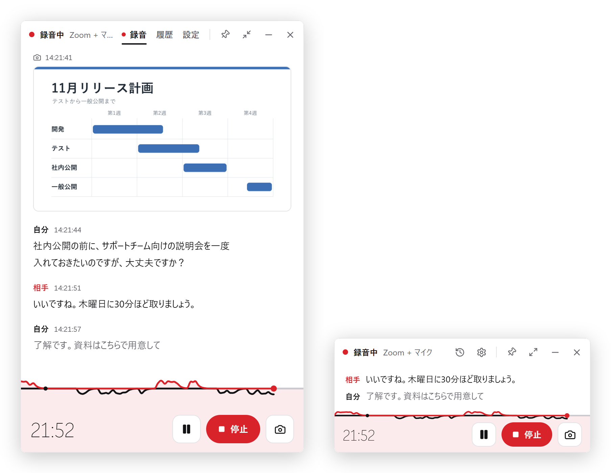

<h1>
  <picture>
    <source media="(prefers-color-scheme: dark)" srcset="docs/images/kikitori-logo-dark.svg">
    
  </picture>
</h1>

[日本語](README.md) · **English**

Kikitori is a Windows app that transcribes meetings, lectures and videos as they happen, **entirely on your PC**.
It tells an app's audio (Zoom, Teams and so on) apart from your microphone, labelling the lines Others and Me, and drops screenshots into the transcript at the moment you take them.
Afterwards, save it as Markdown or PDF, or use Copy for AI agents to ask an AI for a summary.

<picture>
  <source media="(prefers-color-scheme: dark)" srcset="docs/images/screenshot-dark.png">
  
</picture>

- Your audio never goes to the internet: transcription runs on your PC with Whisper.
- Runs on Windows 11 (64-bit). It also runs on Windows 10 22H2, but there it can't record a single app, only all system audio or the microphone.
- Disk space: 200 MB to 1.1 GB per model (the standard one is about 570 MB).
- Made for Japanese first, and in English too: unless Windows is set to Japanese, the app starts in English. Japanese and English speech are transcribed as spoken, never translated.

## Install

1. Download `Kikitori_x.y.z_x64-setup.exe` from [Releases](../../releases/latest).
   - If your browser warns that the file isn't commonly downloaded, choose **Keep** from its "…" menu.
2. Open the downloaded file.
3. If a blue "**Windows protected your PC**" screen appears, click **More info**, then **Run anyway**.
   - It appears because the installer isn't code-signed yet. Kikitori just lacks a signature: it doesn't change your PC's settings or ask for administrator rights.
4. Follow the installer. No administrator rights are needed (it installs for your user only).

## First run

Setup starts on first launch, in English unless Windows is set to Japanese.

1. **Choose a model**: the one that suits your PC is already picked. Keep it.
2. **Download**: the model downloads once (about 570 MB for the standard one). An interrupted download resumes where it stopped.
3. **Mic test**: speak for about 10 seconds; when your words appear, you're ready.
4. **Shortcuts**: off at first; you can set them later in Settings → Hotkeys.

To change the app's language later: Settings → General → Language. If your meetings are in English, also set Settings → Transcription → Transcription language to English.

Before you record anyone, let them know.

## Using it

| To | Do this |
| --- | --- |
| Start or stop recording | **Start** / **Stop** |
| Choose what to transcribe | **Source**: an app (Zoom and so on), All system audio, or Microphone only. Turn on **Record a conversation** to add your own voice as Me |
| Add a screenshot | **Screenshot** while recording |
| Mark where a new topic or scene starts | The **scissors** button while recording. Exports give each part a heading |
| Use the transcript | **Copy**, or **Export** (Markdown as a folder or a ZIP, PDF, Typst). The ⋯ menu has Copy as Markdown and Copy for AI agents |
| See past recordings | **History** in the title bar. You can also fix or delete lines there |

- Recordings are saved automatically in `Documents\Kikitori`, one folder per recording named by date and title (`transcript.md` and images).
- Exports and copies are in Japanese whatever the app's language: lines are labelled 相手 (Others) and 自分 (Me).
- Through speakers, your mic may pick up the other side's voice. Headphones work best (duplicate lines are removed automatically).
- Start/Stop and Screenshot can get keys that work from any app: Settings → Hotkeys (off at first).
- On a PC without a usable GPU, Kikitori runs on the CPU. If it feels slow, choose **Lightweight** in Settings → Models.

## Privacy

- Audio never leaves your PC. Recorded audio is discarded once it is transcribed and is never saved.
- Only two things use the network: model downloads (huggingface.co) and a daily update check (GitHub).
- No telemetry.

## Troubleshooting

- **The app's sound isn't recorded**: switch the source to All system audio (an app that isn't playing anything can't be recorded on its own).
- **Shortcuts don't work**: Windows doesn't deliver them while an app running as administrator is in front.
- **Logs**: **Open logs** at the bottom of Settings. Logs never contain transcript text.
- **Uninstall**: Windows Settings → Apps → Installed apps → Kikitori. Your recordings (`Documents\Kikitori`) stay.

---

## For developers

Tauri 2 + React + TypeScript, Rust backend with whisper.cpp (`whisper-rs`) and WASAPI capture. The full spec is [AppSpec.md](AppSpec.md); design choices are in [docs/DECISIONS.md](docs/DECISIONS.md).

### Prerequisites (Windows 10/11 x64)

- Rust (see the toolchain version in `.github/workflows/ci.yml`) with the MSVC build tools (Visual Studio 2022 Build Tools, "Desktop development with C++")
- Node.js LTS and pnpm (`corepack enable`)
- CMake (comes with the Visual Studio C++ workload)
- For GPU builds: the Vulkan SDK (`winget install KhronosGroup.VulkanSDK --accept-package-agreements --accept-source-agreements`) and LLVM for bindgen (`winget install LLVM.LLVM`)

### Run and test

```sh
pnpm install
pnpm tauri dev          # CPU build
pnpm dev:gpu            # Vulkan build (uses a short cargo target dir, %USERPROFILE%\.kt)
pnpm lint && pnpm typecheck && pnpm test
cd src-tauri && cargo test
```

The integration harness (streaming accuracy and latency against fixture recordings) is described in `src-tauri/tests/pipeline.rs` and [tests/fixtures/README.md](tests/fixtures/README.md).

### Build the installer

```sh
pnpm build:gpu
```

This builds the Vulkan release, downloads the Khronos Vulkan loader (pinned SHA-256) and bundles it next to the exe, collects the licences of every bundled crate and package into `licenses\THIRD-PARTY-NOTICES.txt`, and writes `Kikitori_<version>_x64-setup.exe` under `%USERPROFILE%\.kt\release\bundle\nsis\`.

### Releasing

One-time setup (the update check stays off until this is done):

1. Push this repository to GitHub as a **public** repository named `kikitori` (updates are downloaded from its releases without a token).
2. Generate the updater keys and choose a password. In PowerShell: `npm run tauri signer generate -- -w "$env:USERPROFILE\.tauri\kikitori.key"` (give a full path: the Tauri CLI does not expand `~`).
3. Run `node scripts/enable-updater.mjs <your-github-user>` and commit the change to `src-tauri/tauri.conf.json`.
4. In the repository settings, add the Actions secrets `TAURI_SIGNING_PRIVATE_KEY` (the contents of `kikitori.key`) and `TAURI_SIGNING_PRIVATE_KEY_PASSWORD`. Keep the key and its password safe: without them, installed copies can't be updated.

Each release:

1. Update `version` in `src-tauri/tauri.conf.json` (also `package.json` and `src-tauri/Cargo.toml`) and move the `Unreleased` notes in [CHANGELOG.md](CHANGELOG.md) under the new version.
2. Commit, then tag and push: `git tag v0.1.0 && git push origin v0.1.0`.
3. The `release` workflow builds the installer, the signed update bundle and `latest.json`, and opens a **draft** release. Check it, then publish it; installed copies see the update within a day.

## License

[MIT](LICENSE). Whisper models are downloaded from Hugging Face under their own licenses (MIT, or Apache-2.0 for kotoba-whisper). The bundled Vulkan loader is © The Khronos Group under Apache-2.0 (see `licenses\VulkanRT-License.txt` in the install folder). The licenses of whisper.cpp, Typst and every other crate and package inside the app are in the same `licenses` folder.
